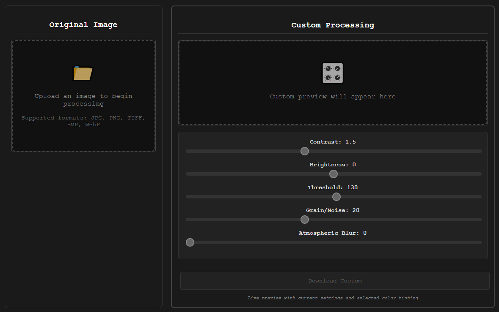
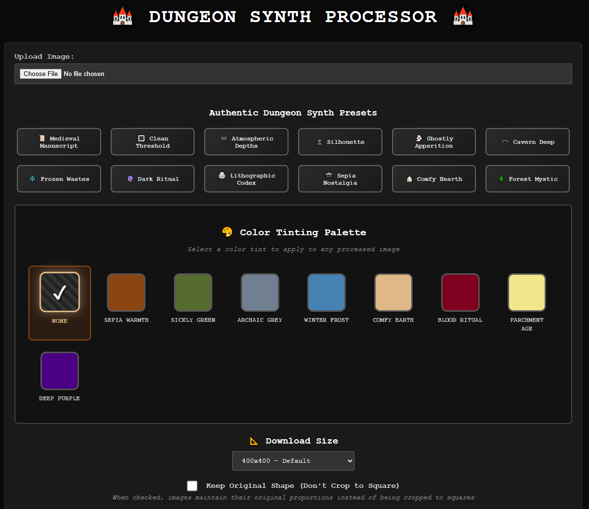
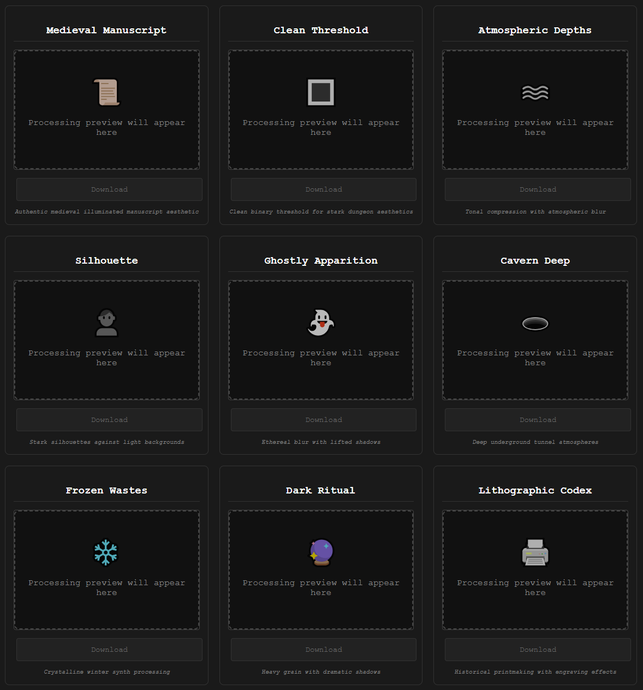
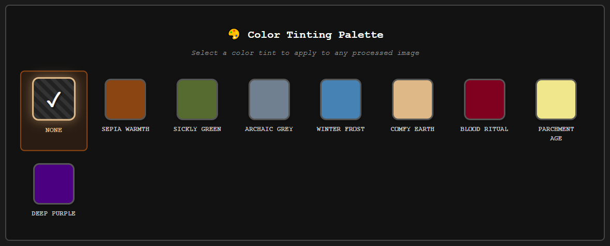

### Manual Controls

# 🏰 Dungeon Synth Image Processor

Transform ordinary images into authentic dungeon synth album cover aesthetics. This local web application provides 12 carefully crafted presets, 9 atmospheric color tints, and precise manual controls for creating evocative imagery.

## Features

- **12 Authentic Presets** - From ancient manuscript textures to crystalline winter processing
- **9 Atmospheric Color Tints** - Deep earth tones, archaic greys, and ritual bloods
- **Real-time Preview** - Witness transformations as parameters shift
- **Multiple Export Resolutions** - 400x400 to 3000x3000 pixels
- **Batch Processing** - Generate all variations simultaneously
- **Complete Privacy** - All processing occurs locally on your machine

## Installation

### Requirements
- Python 3.7 or higher

### Setup
```bash
# Clone the repository
git clone https://github.com/yourusername/dungeon-synth-processor.git
cd dungeon-synth-processor

# Create and activate virtual environment
python -m venv venv

# Windows:
venv\Scripts\activate
# Mac/Linux:
source venv/bin/activate

# Install dependencies
pip install -r requirements.txt
```

### Launch
```bash
python app.py
```

Navigate to: http://localhost:5000

## Interface Overview



The application is organized into four primary sections:

### Upload Section
- Supports JPG, PNG, TIFF, BMP, WebP formats
- Maximum file size: 32MB
- Drag and drop functionality included

### Preset Collection



| Preset | Description |
|--------|-------------|
| **Medieval Manuscript** | Aged parchment with authentic manuscript textures |
| **Clean Threshold** | Pure binary black and white conversion |
| **Atmospheric Depths** | Misty, ethereal processing for otherworldly atmospheres |
| **Silhouette** | Stark forms against pale backgrounds |
| **Ghostly Apparition** | Supernatural blur with lifted shadows |
| **Cavern Deep** | Deep underground tunnel aesthetics |
| **Frozen Wastes** | Crystalline winter processing with minimal grain |
| **Dark Ritual** | Heavy grain for occult atmospheres |
| **Lithographic Codex** | Historical printmaking simulation |
| **Sepia Nostalgia** | Vintage film degradation effects |
| **Comfy Hearth** | Warm, subdued domestic atmospheres |
| **Forest Mystic** | Organic textures with natural depth |

### Color Tinting Palette



Apply subtle atmospheric overlays to processed images:

- **None** - Pure monochromatic processing
- **Sepia Warmth** - Aged photograph tones
- **Sickly Green** - Eerie, supernatural atmosphere
- **Archaic Grey** - Ancient stone textures
- **Winter Frost** - Cold, crystalline blues
- **Comfy Earth** - Warm, natural browns
- **Blood Ritual** - Deep, ominous reds
- **Parchment Age** - Yellowed manuscript tones
- **Deep Purple** - Mystical, arcane atmosphere

### Manual Controls

| Control | Range | Effect |
|---------|-------|--------|
| **Contrast** | 0.5 - 3.0 | Light and shadow separation intensity |
| **Brightness** | -100 to +100 | Overall luminosity adjustment |
| **Threshold** | 0 - 255 | Binary conversion boundary |
| **Grain/Noise** | 0 - 50 | Texture and organic grain |
| **Atmospheric Blur** | 0 - 5 | Ethereal fog effect |

### Export Options


- **400x400** - Standard web format
- **1400x1400** - Bandcamp standard
- **2000x2000** - High resolution
- **3000x3000** - Archival quality

## Usage Workflows

### Basic Processing
1. Upload source image
2. Select desired preset
3. Apply color tinting if desired
4. Download processed result

### Advanced Processing
1. Upload source image
2. Generate all preset variations for comparison
3. Select preferred aesthetic
4. Fine-tune using manual controls
5. Apply atmospheric color tinting
6. Export at desired resolution

### Batch Generation
1. Upload source image
2. Execute "Generate All Variations"
3. Download individual presets as needed

## Technical Implementation

### Processing Pipeline
```
Input → Square Crop → Blur (optional) → Grayscale Conversion
→ Brightness → Contrast → Method Processing → Noise → Color Tint → Output
```

### Processing Methods
- **Threshold Methods**: Binary conversion at specified levels
- **Atmospheric Methods**: Tonal compression with blur
- **Manuscript Methods**: Aged texture simulation
- **Crystalline Methods**: Sharp contrast with minimal grain

### Color Tinting System
- **Blend Modes**: Overlay, Multiply, Soft Light
- **Opacity Range**: 20-35% depending on tint
- **Non-destructive**: Applied after primary processing

## File Specifications

### Supported Formats
| Format | Extensions | Notes |
|--------|------------|-------|
| JPEG | .jpg, .jpeg | Standard format |
| PNG | .png | Lossless with transparency support |
| TIFF | .tif, .tiff | Professional quality |
| BMP | .bmp | Uncompressed bitmap |
| WebP | .webp | Modern web format |

### Limitations
- Maximum upload: 32MB
- Maximum dimensions: 20,000 x 20,000 pixels
- Optimal performance: Under 10MB

## Customization

### Adding Custom Presets

Modify `presets.py`:

```python
'custom_preset': {
    'contrast': 1.5,
    'brightness': 0,
    'threshold': 128,
    'noise': 20,
    'blur': 1.0,
    'method': 'custom',
    'name': 'Custom Preset',
    'description': 'Description of effect'
}
```

### Creating Color Tints

Add to `COLOR_TINTS` in `presets.py`:

```python
'custom_tint': {
    'name': 'Custom Tint',
    'color': '#hexcode',
    'opacity': 0.3,
    'blend_mode': 'overlay'
}
```

## Troubleshooting

### Common Issues

**Port Conflicts**
```bash
# Application automatically finds available port
# Manual specification: python app.py --port 5001
```

**Missing Dependencies**
```bash
# Ensure virtual environment is active
# Reinstall: pip install -r requirements.txt
```

**Performance with Large Images**
- Files over 10MB require longer processing time
- Consider resizing before upload for optimal performance
- Processing optimized for images under 5000x5000 pixels

### Browser Compatibility
- Chrome/Edge: Full functionality
- Firefox: Full functionality
- Safari: Full functionality
- Mobile browsers: Limited to smaller file sizes

## Recommendations

### Source Material
- High contrast subjects yield optimal results
- Clear foreground/background separation enhances processing
- Avoid overly complex compositions

### Preset Selection
- Medieval/Lithographic: Ideal for text and symbolic imagery
- Atmospheric/Ghostly: Suited for landscapes and ambient scenes
- Silhouette/Threshold: Perfect for stark, dramatic imagery
- Forest/Comfy: Best for organic and natural subjects

### Color Application
- Apply tinting after achieving desired monochromatic processing
- Sepia/Parchment: Historical and aged aesthetics
- Green/Purple: Supernatural and otherworldly moods
- Grey/Frost: Cold, distant atmospheres

### Export Guidelines
- 400x400: Web use and social media
- 1400x1400: Music streaming platforms
- 2000x2000+: Physical media and high-quality prints

## Privacy and Security

- **Local Processing Only** - No external server communication
- **No Data Collection** - Complete user privacy
- **Automatic Cleanup** - Temporary files removed on exit
- **Open Source** - All code available for inspection

## License

Open source software - free for use and modification.

## Credits
Luc Mercier  
Developed with Claude (Anthropic)

---